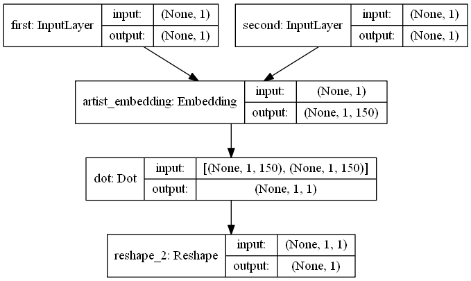

# artist-suggestion-system
 Keras embedding model suggesting artist similar to the given one.
 
### Notebooks

* *Artist suggestions (research)* - data preprocessing, model training and evaluation
* *Artist suggestions (inference)* - quick artist recommendations
 
### Model

 
### Inference
Prerequisites:
* Keras
* Numpy
* Pandas

Download this [archive](https://drive.google.com/file/d/1BKh4kSezkYncIY84StTFKU2wOW2UuJv-/view?usp=sharing) and extract **tracks_short.csv** to data/csv/ and **150_embedding.h5** to models/
